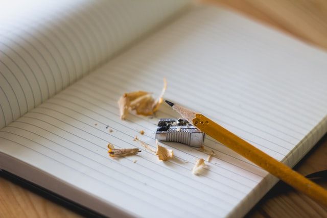

(From an older friend)

1. Income: Never depend on a single source of income. Make an investment to create a second chance.

2. Spend: If you keep buying things you don't need, you'll soon have to sell the things you need.

3. Rank: Don't save what is left after spending, but spend what is left after saving.

4. Risks: Never try a rivers's depth with boot feet.

5. Investment: Don't put all your eggs in one basket.

6. Expectations: Honest is a very expensive gift. Don't expect it from miserly people.

7. Live for present: If you ar depressed, you are living in the past. If you are worried, you are living in the future. If you are at peace, you are living in the present.

The past is a piece of paper. The present is a newspaper and the future is a quetionnaire.

8. How to deal with bad things: When bad things happen in your life, you have three options: you can let it identify you, let it destroy you or let it make you stronger.

9. Poor and rich: empty bags teach you a million things in life, but full bags damage you in a million ways.

10. Loke to the future: Out eyes are ahead because looking forward ahead is more important than looking back.

11. About the mistake: When we were little, we used pencils but now we us a fountain pen, do you know why? Because childhood mistakes can be eased but not now. So read and write carefully or your life will be a tissue.
