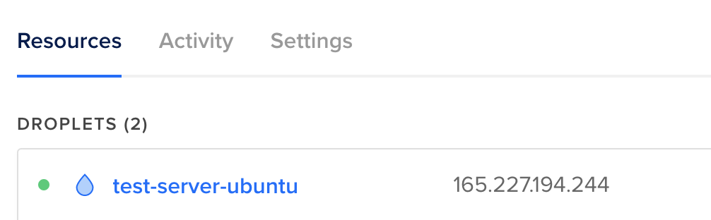
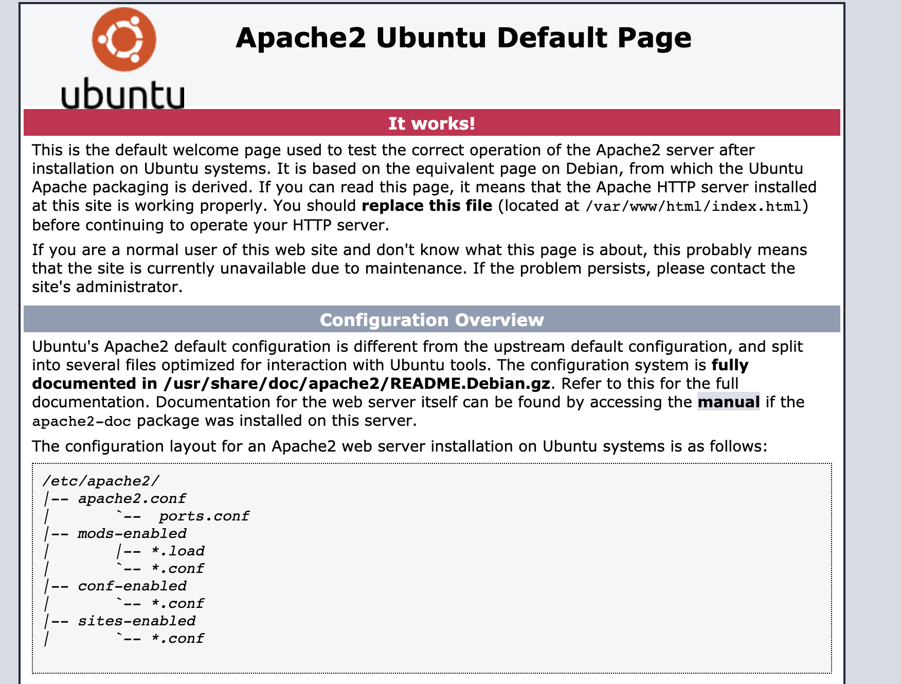
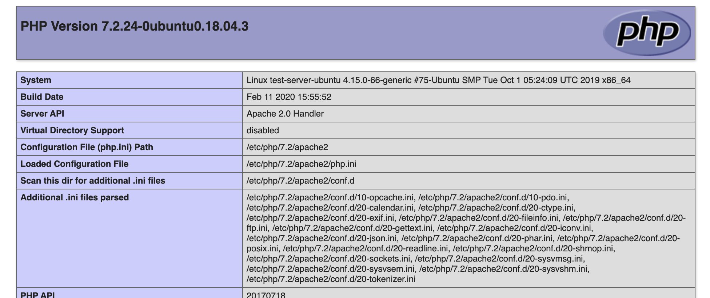
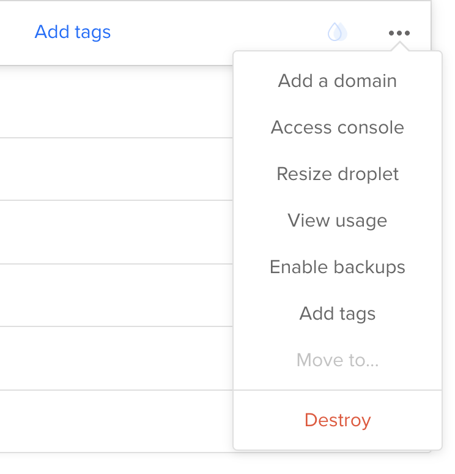

If you do not have an account, you can register an account through the ref [link](https://m.do.co/c/a5600c1fbe6e) <3. If you have already , continue down the steps below.

## Step 1: Create new droplet

**Setup SSH**

Dashboard -> Account -> Security -> SSH Keys

Or open this [Link](https://cloud.digitalocean.com/account/security)

Click 'Add SSH Keys'

(google if you dont know what is this :D)

**Create a Droplet**

Click 'Create' > 'Droplets'

Select the cheapest package is enough:

- Distribution: Ubuntu

**Choose a plan**

- Starter - Standard: \$0.007/hour
- Choose a datacenter region: any region you, should near your location.
- Select additional option: SSH Keys
- Select Project: any project
- Choose a hostname: test-server-ubuntu

Click 'Create Droplet' Button.

You will got the result like this image:


## Step 2: Setup theme for your Terminal.

_This step is not necessary, but if you do it, it will be more intuitive, making it easier for you to follow these steps._

'165.227.194.244' is my server, replace with your Ip server.

**Login to the server**

```bash
~ ssh root@165.227.194.244
```

You will get the the message like this

```
The authenticity of host '165.227.194.244 (165.227.194.244)' can't be established.
ECDSA key fingerprint is SHA256:4XWJdydZwrkfp5IuQ7/9Ic6HDZjtWdYqaGVGcr0gRk0.
Are you sure you want to continue connecting (yes/no/[fingerprint])? yes
Warning: Permanently added '165.227.194.244' (ECDSA) to the list of known hosts.
Welcome to Ubuntu 18.04.3 LTS (GNU/Linux 4.15.0-66-generic x86_64)
```

At the server:

```console
~ vi ~/.bashrc
```

Press 'i' for insert,
Esc -> :w -> Save the file.
Esc -> :q -> Quit the Vi Editor

- Copy the below line and add it at the end of _.bashrc_ file:

```bash
PS1='\[\033[1;36m\]\u\[\033[1;31m\]@\[\033[1;32m\]\h:\[\033[1;35m\]\w\[\033[1;31m\]\$\[\033[0m\] '
```

Exit & Login again to see the effect.

```console
~ exit
```

```console
~ ssh root@165.227.194.244
```

## Step 3 Install Apache

If this step you got error, you can read at [More detail](https://vitux.com/how-to-install-and-configure-apache-web-server-on-ubuntu/)

```
~ sudo apt update
~ sudo apt install apache2
```

Check the version

```console
~ apache2 -version
```

Check status of Apache

```console
~ sudo systemctl status apache2
```

Check IP

```
~ hostname -I
```

Verifying that the Apache server is working properly. (Replace with your IP)
http://165.227.194.244



## Step 4: Install PHP 7.2

[More detail](https://linuxize.com/post/how-to-install-php-on-ubuntu-18-04/)

```console
~ sudo apt install php libapache2-mod-php
```

Testing PHP: Edit the file info.php

```
vi /var/www/html/info.php
```

With this content:

```php
<?php
phpinfo();
```

View the content:

```
cat /var/www/html/info.php
```

Verifing that the PHP works:

http://165.227.194.244/info.php



## Step 5 Install MySQL

[More Detail](https://linuxize.com/post/how-to-install-mysql-on-ubuntu-18-04/)

Install mysql:

```console
~ sudo apt install mysql-server
```

Verifing mysql:

```console
~ sudo systemctl status mysql
```

Press 'q' to quit

Securing Mysql:

```
sudo mysql_secure_installation
```

=> Setup root password: 0 = LOW
username: root
password: your_root_pass

I choose 'yes' for all the questions

Verifing: Try to login and show database

```
~/sudo mysql
```

```mysql
mysql> show databases;
mysql> exit;
```

## Step 6: Enable mysql to apache

[More detail](https://www.digitalocean.com/community/tutorials/how-to-install-linux-apache-mysql-php-lamp-stack-on-ubuntu-16-04#step-2-install-mysql)

Install mysql lib:

```
~ apt-get update
~ apt-get install php7.2-mysql
~ apt-get install php-mysql
```

Verifing:

```
~ apt-cache search mysql

```

Restart apache

```
systemctl restart apache2.service

```

## STEP 7: Install PHPMyAdmin

[More detail](https://www.digitalocean.com/community/tutorials/how-to-install-and-secure-phpmyadmin-on-ubuntu-16-04)

Install:

```
$ sudo apt-get update
$ sudo apt-get install phpmyadmin php-mbstring php-gettext
```

=> Select: apache2 > OK => Yes (Configure db for phpmyadmin)

Configure db for phpmyadmin with: 'yes'

Write down your password: your_password (username:phpmyadmin)

### Config FOR phpmyadmin

[Read more](https://askubuntu.com/questions/763336/cannot-enter-phpmyadmin-as-root-mysql-5-7) if you got bug.

```
~ sudo mysql
```

```sql
mysql> GRANT ALL PRIVILEGES ON *.* TO 'phpmyadmin'@'localhost' WITH GRANT OPTION;
mysql> FLUSH PRIVILEGES;
```

Test
http://165.227.194.244/phpmyadmin/
user: phpmyadmin
pass: your_password

Create a test database: wp_example

More: (?)

```
$ sudo phpenmod mcrypt
$ sudo phpenmod mbstring
```

## Step 8 : Add domain to droplet.

Follow this [Link](https://www.digitalocean.com/docs/networking/dns/how-to/add-domains/) to add your domain to this droplet.

Add: example.com
Wait for server hours and try: http://example.com



## Step 9 : Install WordPress

_If you dont need wordpress site. You can skip this step._

Download wordpress to server. Unzip it to public folder && grant permission for www-data

```
~ wget http://wordpress.org/latest.tar.gz
~ tar -xf ./latest.tar.gz
~ mv ./wordpress/*  /var/www/html/
~ cd /var/www/html && chown -R www-data:www-data ./ ./*
~ rm -rf /var/www/html/index.html
```

Open: http://165.227.194.244
To Install your website with the username & password above (phpmyadmin or root are also ok)

## Step 10: Setup Ssl for your site

For [more detail](https://certbot.eff.org/lets-encrypt/ubuntubionic-apache)

Or:

```
~ sudo apt-get install certbot python-certbot-apache
~ sudo certbot --apache
```

Select (A)
Select (Y)
Type your domain name: your-domain.com
Select: 2 - For Redirect ...

Verifing: http://your-domain.com

Go to WordPress's Admin panel > Setting:
WordPress Address (URL): https://your-domain.com
Site Address (URL):https://your-domain.com
=>Click 'Save changes' Button

Verifing: http://your-domain.com

If this link is auto to redirect to https://your-domain.com, you are DONE.

## Step 11: Setup the second site.

- Add domain to droplet: theseconddomain.com

- Change DNS to:

* ns1.digitalocean.com
* ns2.digitalocean.com

- Create the public folder & index file. Change the owner for it

Create the below folder:

```bash
/var/www/
|--theseconddomain.com
|   |__ public_html
```

vi /var/www/theseconddomain.com/public_html/index.html

```txt
Hello from theseconddomain.com
```

```
cat /var/www/theseconddomain.com/public_html/index.html
```

sudo chown -R www-data: /var/www/theseconddomain.com/public_html

Set config for apache:

```bash
vi /etc/apache2/sites-available/theseconddomain.com.conf
```

With this content:

```bash
<VirtualHost *:80>
    ServerName theseconddomain.com
    ServerAlias www.theseconddomain.com
    ServerAdmin webmaster@theseconddomain.com
    DocumentRoot /var/www/theseconddomain.com/public_html

    <Directory /var/www/theseconddomain.com/public_html>
        Options -Indexes +FollowSymLinks
        AllowOverride All
    </Directory>

    ErrorLog ${APACHE_LOG_DIR}/theseconddomain.com-error.log
    CustomLog ${APACHE_LOG_DIR}/theseconddomain.com-access.log combined
</VirtualHost>
```

```console
cat /etc/apache2/sites-available/theseconddomain.com.conf
```

```console
~ sudo a2ensite theseconddomain.com
~ systemctl reload apache2
```

### Enable Ssl for the site

(Same as above step)

```
~ sudo certbot --apache
```

Select (A)
Select (Y)
Follow the instructions.
Select: 2 - For Redirect ...
